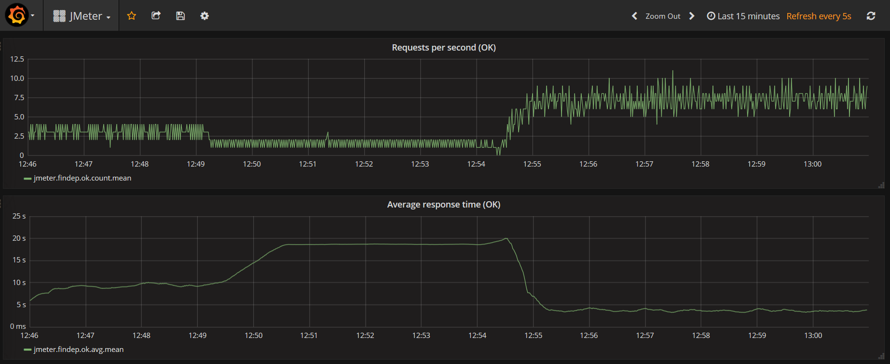

= grain4jmeter-docker

Grafana &amp; InfluxDB Docker container for JMeter.

Inspired by https://github.com/sarkershantonu/jmeter-grafana-influxdb-docker but changed to have both Grafana and InfluxDB in the same image.

Purpose of this image is to show realtime results of JMeter test plans in testing and demonstration environments.

Sample dashboard is configured to show requests/seconds, average response time/second and couple of others.

== Usage

Get container from Dockerhub:

```
docker pull kazhar/grain4jmeter
```

Or build docker image using:

```
docker build -t grain4jmeter .
```

Run docker container, expose port 3000 and 2003:

```
docker run -it --rm -p 3000:3000 -p 2003:2003 kazhar/grain4jmeter
```

Open Grafana dashboard:

* [http://127.0.0.1:3000/dashboard/db/jmeter](http://127.0.0.1:3000/dashboard/db/jmeter)
* Default username/password:
** _admin/passw0rd_

Configure JMeter:

* http://jmeter.apache.org/usermanual/realtime-results.html

== JMeter sample

Sample JMeter test plan is [jmeter/sample_jmeter_test.jmx](jmeter/sample_jmeter_test.jmx). It is simple test that sends HTTP GET request to google.com about 10 times per second.

The container image includes JMeter. To run sample test plan, execute following command in the container:

```
./run-jmeter-test.sh <URL>
```


== Image

.Grafana 6.0.2 UI


